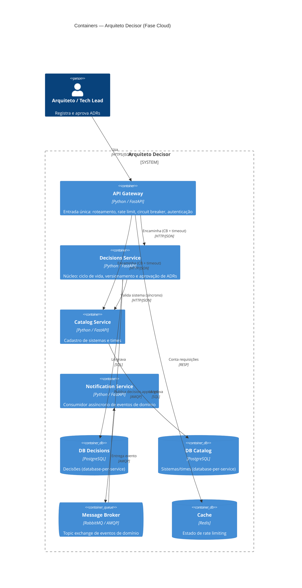

<div align="center">

# Arquiteto Decisor

**SaaS para registrar, versionar e comparar trade-offs de decisões arquiteturais (ADRs).**

`Python 3.12` · `FastAPI` · `Microsserviços` · `RabbitMQ` · `PostgreSQL` · `Docker`

</div>

---

## Visão Executiva

### O que é
O **Arquiteto Decisor** é uma plataforma multi-tenant onde times de engenharia
documentam suas **decisões arquiteturais** como ADRs versionados, vinculados aos
sistemas a que pertencem, com seus **trade-offs** explícitos.

### Qual problema resolve
Conhecimento arquitetural se perde em wikis dispersas, threads de chat e na
cabeça das pessoas. Quando alguém pergunta *"por que escolhemos isto?"*, a
resposta raramente está registrada. O Arquiteto Decisor transforma esse
conhecimento em um **ativo versionado, rastreável e auditável** — o produto é,
ele próprio, uma ferramenta de governança de decisões.

### Estado atual (Fase Cloud)
O sistema **deixou de ser um monólito** (Fases 1–2) e passou a uma **malha de
microsserviços executando em nuvem**:

- **API Gateway** como entrada única (roteamento, rate limit, circuit breaker);
- **Decisions Service** (núcleo dos ADRs) e **Catalog Service** (sistemas/times);
- **Notification Service**, consumidor **assíncrono** de eventos de domínio;
- comunicação **híbrida**: REST síncrono para comandos/consultas e eventos
  assíncronos (RabbitMQ) para efeitos colaterais;
- persistência **database-per-service** (PostgreSQL por serviço).

As três decisões estruturantes desta fase estão registradas como ADRs
(ver [Decisões Arquiteturais](#-decisões-arquiteturais-adrs)).

---

## Diagrama C4 de Containers

> Diagrama renderizado diretamente em **Mermaid** (sintaxe nativa, sem imagens
> externas). Versão isolada em [`docs/diagrams/c4-container.md`](docs/diagrams/c4-container.md).



Demais visões: [Contexto (C4 L1)](docs/diagrams/c4-context.md) ·
[Componentes (C4 L3)](docs/diagrams/c4-component-decisions.md) ·
[Sequência síncrona](docs/diagrams/sequence-sync.md) ·
[Sequência assíncrona](docs/diagrams/sequence-async.md) ·
[Implantação em nuvem](docs/diagrams/deployment-cloud.md).

---

## Stack Tecnológica

| Camada | Tecnologia | Papel |
|---|---|---|
| Borda | FastAPI + pybreaker + Redis | Gateway, rate limit, circuit breaker |
| Serviços | FastAPI + SQLAlchemy | Lógica de domínio |
| Mensageria | RabbitMQ (AMQP, pika) | Eventos assíncronos |
| Dados | PostgreSQL (1 por serviço) | Persistência |
| Empacotamento | Docker + docker-compose | Execução local e em nuvem |

---

## Estrutura do Repositório

```
arquiteto-decisor-c3/
├── src/                      # microsserviços (FastAPI)
│   ├── api-gateway/          # borda: roteamento, rate limit, circuit breaker
│   ├── decisions-service/    # núcleo: ADRs, aprovação, eventos
│   ├── catalog-service/      # cadastro de sistemas/times
│   └── notification-service/ # consumidor assíncrono
├── docs/
│   ├── adrs/                 # decisões arquiteturais (0001–0003) + template
│   ├── sad/                  # documento de arquitetura (sad-fase3.md)
│   └── diagrams/             # diagramas C4 e de sequência (Mermaid)
├── gold-plating/             # artefatos extras (CI, automações, observabilidade)
├── scripts/smoke.sh          # teste de fumaça end-to-end
├── docker-compose.yml        # orquestração local
├── Makefile                  # atalhos de desenvolvimento
└── README.md
```

---

## Como Executar Localmente

### Pré-requisitos
- Docker + Docker Compose

### Subir toda a malha
```bash
make up            # ou: docker compose up --build -d
```
Isso sobe gateway, os três serviços e a infraestrutura (PostgreSQL ×2, RabbitMQ,
Redis). Pontos de acesso:

| Recurso | URL |
|---|---|
| API Gateway | http://localhost:8080 |
| Docs interativas (Swagger) | http://localhost:8080/docs |
| Painel RabbitMQ | http://localhost:15672 (guest/guest) |

### Teste de fumaça (fluxo completo)
```bash
make smoke         # cadastra sistema → cria ADR → aprova (dispara evento)
```
Ou manualmente:
```bash
# 1) cadastrar um sistema
curl -X POST http://localhost:8080/api/systems \
  -H 'content-type: application/json' \
  -d '{"name":"checkout","team":"Payments","description":"Fluxo de pagamento"}'

# 2) registrar um ADR (use o id retornado acima em system_id)
curl -X POST http://localhost:8080/api/decisions \
  -H 'content-type: application/json' \
  -d '{"system_id":"<ID>","title":"Adotar Circuit Breaker","decision":"Sim"}'

# 3) aprovar (publica decision.approved → notification-service)
curl -X POST http://localhost:8080/api/decisions/<DECISION_ID>/approve
```
Acompanhe a notificação no log: `docker compose logs -f notification-service`.

### Rodar os testes
```bash
make test          # pytest por serviço (usa SQLite local, sem infraestrutura)
make lint          # ruff
```

### Derrubar
```bash
make down          # ou: make clean (remove volumes)
```

---

## Decisões Arquiteturais (ADRs)

| # | Decisão | Documento |
|---|---|---|
| 0001 | **Estratégia de Nuvem e Escalabilidade** — PaaS de contêineres + escala horizontal | [📄 0001-estrategia-nuvem.md](docs/adrs/0001-estrategia-nuvem.md) |
| 0002 | **Padrões de Resiliência** — API Gateway + Circuit Breaker + Bulkhead | [📄 0002-padrao-resiliencia.md](docs/adrs/0002-padrao-resiliencia.md) |
| 0003 | **Modelo de Comunicação** — híbrido (síncrono + assíncrono) | [📄 0003-modelo-comunicacao.md](docs/adrs/0003-modelo-comunicacao.md) |

📘 **Documento de Arquitetura (SAD):** [docs/sad/sad-fase3.md](docs/sad/sad-fase3.md)
🧩 **Template de ADR:** [docs/adrs/template.md](docs/adrs/template.md)

---

## Roadmap

- [ ] Autenticação OIDC real no gateway
- [ ] Padrão *Transactional Outbox* no decisions-service
- [ ] Migrações de schema com Alembic
- [ ] Tracing distribuído (OpenTelemetry) e métricas (Prometheus)
- [ ] Interface web para navegação dos ADRs

---

## 📄 Licença

Distribuído sob a licença MIT. Uso acadêmico.
