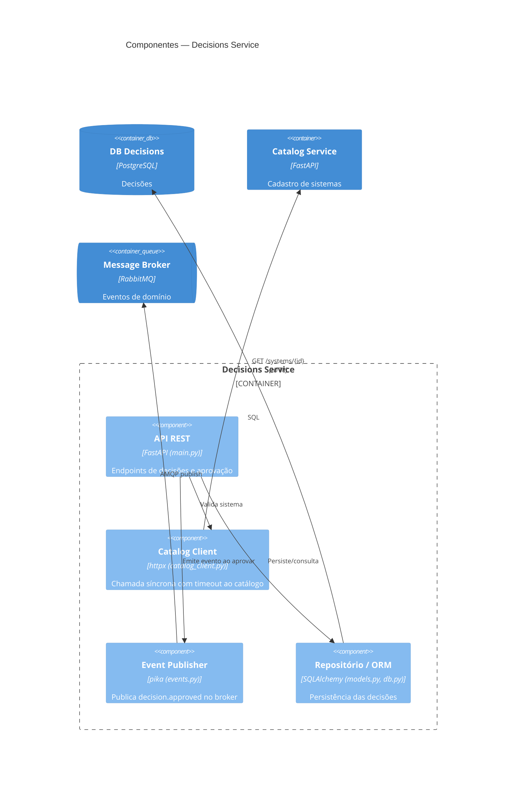

# C4 — Nível 3: Componentes do Decisions Service

Detalhe interno do container **Decisions Service**, o núcleo do domínio.

```mermaid
C4Component
    title Componentes — Decisions Service

    Container_Boundary(decisions, "Decisions Service") {
        Component(api, "API REST", "FastAPI (main.py)", "Endpoints de decisões e aprovação")
        Component(catalogClient, "Catalog Client", "httpx (catalog_client.py)", "Chamada síncrona com timeout ao catálogo")
        Component(publisher, "Event Publisher", "pika (events.py)", "Publica decision.approved no broker")
        Component(repo, "Repositório / ORM", "SQLAlchemy (models.py, db.py)", "Persistência das decisões")
    }

    ContainerDb(db, "DB Decisions", "PostgreSQL", "Decisões")
    Container(catalog, "Catalog Service", "FastAPI", "Cadastro de sistemas")
    ContainerQueue(broker, "Message Broker", "RabbitMQ", "Eventos de domínio")

    Rel(api, catalogClient, "Valida sistema")
    Rel(api, repo, "Persiste/consulta")
    Rel(api, publisher, "Emite evento ao aprovar")
    Rel(catalogClient, catalog, "GET /systems/{id}", "HTTP")
    Rel(repo, db, "SQL")
    Rel(publisher, broker, "AMQP publish")
```
