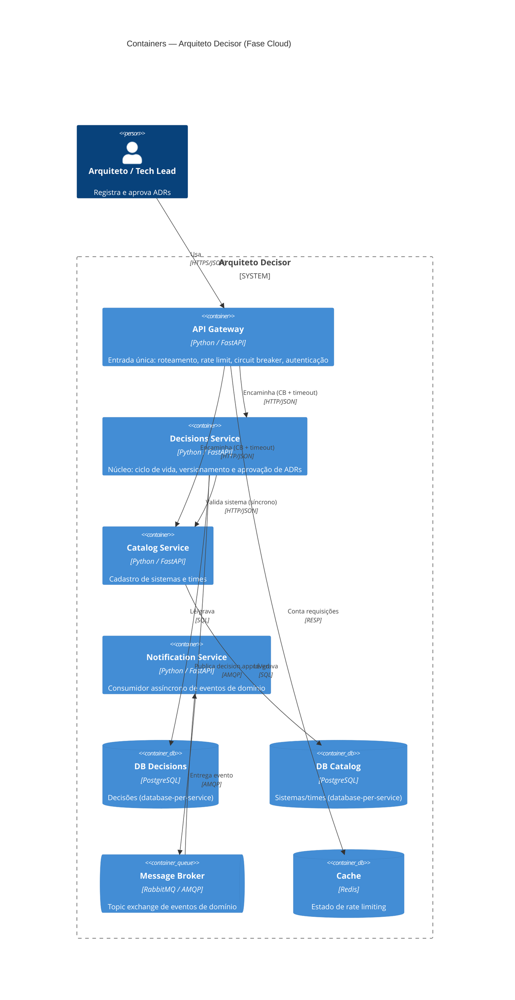

# C4 — Nível 2: Diagrama de Containers

Decomposição do Arquiteto Decisor em containers (processos implantáveis). Este é
o mesmo diagrama embutido no `README.md`.

```mermaid
C4Container
    title Containers — Arquiteto Decisor (Fase Cloud)

    Person(arquiteto, "Arquiteto / Tech Lead", "Registra e aprova ADRs")

    System_Boundary(decisor, "Arquiteto Decisor") {
        Container(gateway, "API Gateway", "Python / FastAPI", "Entrada única: roteamento, rate limit, circuit breaker, autenticação")
        Container(decisions, "Decisions Service", "Python / FastAPI", "Núcleo: ciclo de vida, versionamento e aprovação de ADRs")
        Container(catalog, "Catalog Service", "Python / FastAPI", "Cadastro de sistemas e times")
        Container(notification, "Notification Service", "Python / FastAPI", "Consumidor assíncrono de eventos de domínio")

        ContainerDb(dbDecisions, "DB Decisions", "PostgreSQL", "Decisões (database-per-service)")
        ContainerDb(dbCatalog, "DB Catalog", "PostgreSQL", "Sistemas/times (database-per-service)")
        ContainerQueue(broker, "Message Broker", "RabbitMQ / AMQP", "Topic exchange de eventos de domínio")
        ContainerDb(cache, "Cache", "Redis", "Estado de rate limiting")
    }

    Rel(arquiteto, gateway, "Usa", "HTTPS/JSON")
    Rel(gateway, decisions, "Encaminha (CB + timeout)", "HTTP/JSON")
    Rel(gateway, catalog, "Encaminha (CB + timeout)", "HTTP/JSON")
    Rel(gateway, cache, "Conta requisições", "RESP")
    Rel(decisions, catalog, "Valida sistema (síncrono)", "HTTP/JSON")
    Rel(decisions, dbDecisions, "Lê/grava", "SQL")
    Rel(catalog, dbCatalog, "Lê/grava", "SQL")
    Rel(decisions, broker, "Publica decision.approved", "AMQP")
    Rel(broker, notification, "Entrega evento", "AMQP")

    UpdateLayoutConfig($c4ShapeInRow="2", $c4BoundaryInRow="1")
```
