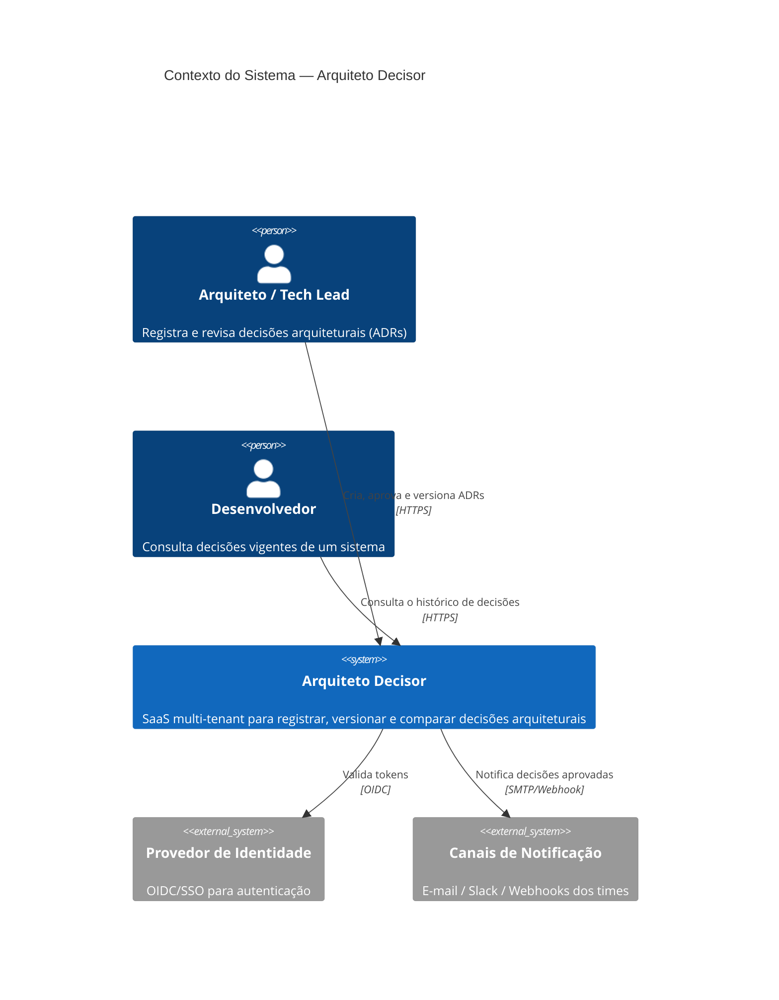

# C4 — Nível 1: Diagrama de Contexto

Visão de mais alto nível: o sistema **Arquiteto Decisor** e seus atores e
sistemas externos.

```mermaid
C4Context
    title Contexto do Sistema — Arquiteto Decisor

    Person(arquiteto, "Arquiteto / Tech Lead", "Registra e revisa decisões arquiteturais (ADRs)")
    Person(dev, "Desenvolvedor", "Consulta decisões vigentes de um sistema")

    System(decisor, "Arquiteto Decisor", "SaaS multi-tenant para registrar, versionar e comparar decisões arquiteturais")

    System_Ext(idp, "Provedor de Identidade", "OIDC/SSO para autenticação")
    System_Ext(notif, "Canais de Notificação", "E-mail / Slack / Webhooks dos times")

    Rel(arquiteto, decisor, "Cria, aprova e versiona ADRs", "HTTPS")
    Rel(dev, decisor, "Consulta o histórico de decisões", "HTTPS")
    Rel(decisor, idp, "Valida tokens", "OIDC")
    Rel(decisor, notif, "Notifica decisões aprovadas", "SMTP/Webhook")

    UpdateLayoutConfig($c4ShapeInRow="2", $c4BoundaryInRow="1")
```
