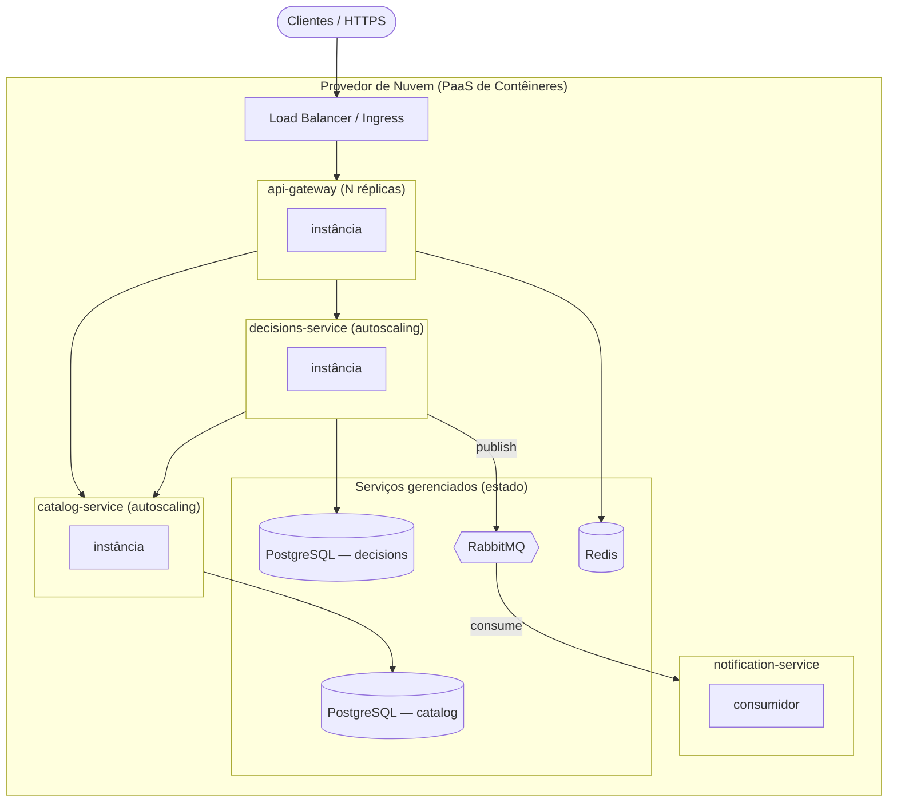

# Implantação em Nuvem (Deployment)

Visão de implantação alvo segundo o ADR 0001: contêineres em PaaS gerenciado com
escalabilidade horizontal e recursos de estado gerenciados.

```mermaid
flowchart TB
    user([Clientes / HTTPS])

    subgraph cloud["Provedor de Nuvem (PaaS de Contêineres)"]
        lb["Load Balancer / Ingress"]

        subgraph gw["api-gateway (N réplicas)"]
            g1["instância"]
        end
        subgraph dec["decisions-service (autoscaling)"]
            d1["instância"]
        end
        subgraph cat["catalog-service (autoscaling)"]
            c1["instância"]
        end
        subgraph ntf["notification-service"]
            n1["consumidor"]
        end

        subgraph managed["Serviços gerenciados (estado)"]
            pgd[("PostgreSQL — decisions")]
            pgc[("PostgreSQL — catalog")]
            mq{{"RabbitMQ"}}
            rd[("Redis")]
        end
    end

    user --> lb --> gw
    gw --> dec
    gw --> cat
    gw --> rd
    dec --> cat
    dec --> pgd
    cat --> pgc
    dec -- publish --> mq
    mq -- consume --> ntf
```
