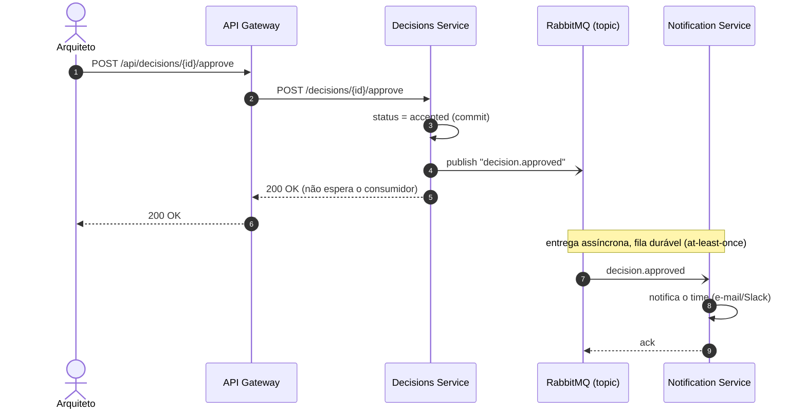

# Sequência — Fluxo Assíncrono: aprovar e notificar

Demonstra a comunicação **assíncrona event-driven**: o produtor não espera o
consumidor; o desacoplamento é pelo contrato do evento.

```mermaid
sequenceDiagram
    autonumber
    actor U as Arquiteto
    participant G as API Gateway
    participant D as Decisions Service
    participant B as RabbitMQ (topic)
    participant N as Notification Service

    U->>G: POST /api/decisions/{id}/approve
    G->>D: POST /decisions/{id}/approve
    D->>D: status = accepted (commit)
    D-)B: publish "decision.approved"
    D-->>G: 200 OK (não espera o consumidor)
    G-->>U: 200 OK

    Note over B,N: entrega assíncrona, fila durável (at-least-once)
    B-)N: decision.approved
    N->>N: notifica o time (e-mail/Slack)
    N-->>B: ack
```
