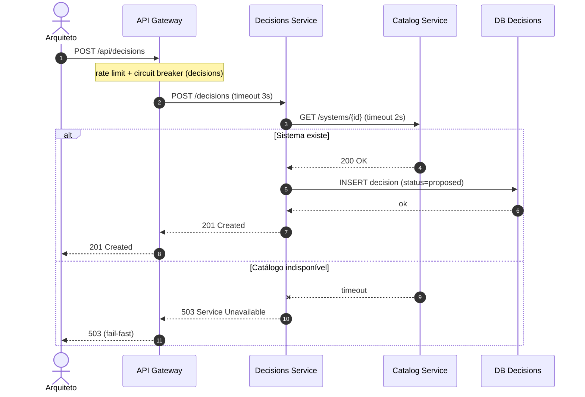

# Sequência — Fluxo Síncrono: criar uma decisão

Demonstra a comunicação **síncrona** (request/response) com timeout e circuit
breaker, e a validação cruzada com o catálogo.

```mermaid
sequenceDiagram
    autonumber
    actor U as Arquiteto
    participant G as API Gateway
    participant D as Decisions Service
    participant C as Catalog Service
    participant DB as DB Decisions

    U->>G: POST /api/decisions
    Note over G: rate limit + circuit breaker (decisions)
    G->>D: POST /decisions (timeout 3s)
    D->>C: GET /systems/{id} (timeout 2s)
    alt Sistema existe
        C-->>D: 200 OK
        D->>DB: INSERT decision (status=proposed)
        DB-->>D: ok
        D-->>G: 201 Created
        G-->>U: 201 Created
    else Catálogo indisponível
        C--xD: timeout
        D-->>G: 503 Service Unavailable
        G-->>U: 503 (fail-fast)
    end
```
