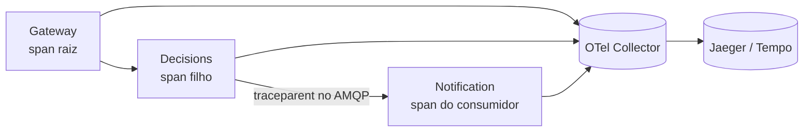

# Estratégia de Observabilidade

Sistemas distribuídos só são operáveis se forem observáveis. Esta nota descreve
os três pilares (logs, métricas, tracing) aplicados ao Arquiteto Decisor,
cobrindo tanto o caminho **síncrono** quanto o **assíncrono**.

## 1. Logs estruturados
Cada serviço emite logs em JSON com um **`correlation_id`** propagado do gateway
para todos os saltos — inclusive embutido no payload do evento `decision.approved`,
para que o `notification-service` mantenha a correlação ao processar a mensagem.

## 2. Métricas (Prometheus)
Métricas RED por serviço:
- **Rate** — requisições/seg por rota;
- **Errors** — taxa de 4xx/5xx;
- **Duration** — latência (p50/p95/p99).

Métricas específicas de resiliência:
- estado dos **circuit breakers** (fechado/aberto/half-open) por upstream;
- requisições **barradas por rate limit** (429);
- **profundidade da fila** e **idade da mensagem** no RabbitMQ.

## 3. Tracing distribuído (OpenTelemetry)
Instrumentação OTel nos serviços FastAPI propaga o *trace context* (W3C
`traceparent`) nas chamadas HTTP. Para o salto assíncrono, o contexto viaja nos
*headers* da mensagem AMQP, ligando o **span de publicação** (decisions-service)
ao **span de consumo** (notification-service) — fechando a lacuna típica de
visibilidade em fluxos event-driven.

## Dashboards e alertas sugeridos
- Alerta quando um circuit breaker abre (sinaliza upstream degradado).
- Alerta de idade de mensagem na fila acima do SLA (consumidor atrasado).
- Painel de latência fim-a-fim do fluxo "criar → aprovar → notificar".
